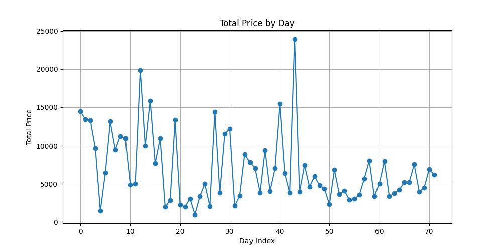
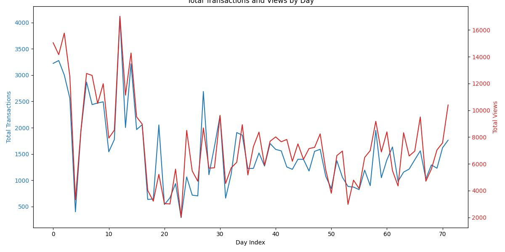

# IBM AI Enterprise Workflow Capstone

## Part 1

> (1) Assimilate the business scenario and articulate testable hypotheses.

Business Scenario:

In this project we will forecast revenue for May based on historical data (from April and earlier). This can be used to forecast sales.

Some testable hypotheses:

Hypothesis 1: “Broadcast viewership in April is positively related to revenue generated in May.”

These hypotheses focus on the relationships between broadcast viewership, customer activity, and revenue.

> (2) State the ideal data to address the business opportunity and clarify the rationale for needing specific data.

All available data can be useful in achieving the desired goal of verifying the theory.

3,4 and 5
Example on the first four files

